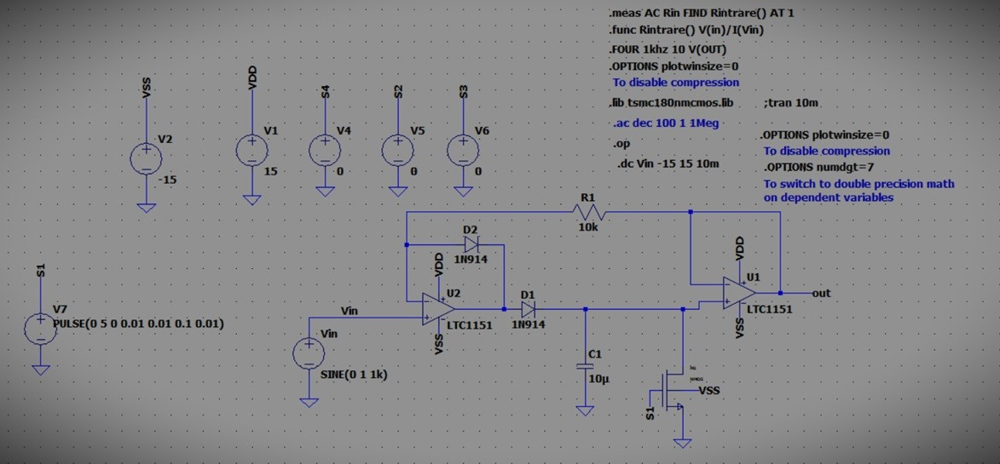

University: Technical University of Cluj-Napoca  
Course: Analog Integrated Circuit Systems  
Author: Zabunov Daniil    
Year: 2024      

Project Overview  

This project involves designing a multi-stage analog signal processing circuit using the OP-AMP LTC1151.  
The design consists of four main stages, each serving a specific function for signal amplification, filtering, gain adjustment, and peak detection.  

Stage 1: Signal Amplification  

The first stage is an amplifier with a gain configuration of 20, where feedback and gain resistors are used to achieve the desired output.  
The output is designed to produce an ideal voltage of up to 49.64 mV. To minimize offset errors, a compensation source is added at the inverting terminal with a resistor divider network.  
The compensation voltage calculation ensures an output correction of approximately 2.00822 µV.    

Stage 2: Bandpass Filter  

The second stage is a Sallen-Key bandpass filter, designed to pass frequencies with a bandwidth of 2 kHz and a quality factor of 1.73.      
The resistor and capacitor values are selected to meet these requirements.  
This stage provides a gain of approximately 3.87 at the center frequency.    

Stage 3: Programmable Gain Amplifier (PGA)  

The third stage is a programmable gain amplifier, allowing variable gains with minimum and maximum values of 1 dB and 20 dB, respectively.    
The gain steps are set at 6 dB intervals across four discrete steps.  
The PGA is configured using resistors, where varying the feedback resistor achieves the desired gains.  
This flexibility enables the adjustment of amplification based on specific input conditions.  

Stage 4: Positive Peak Detector  

The final stage is a positive peak detector circuit with a gain of 1, using the OP-AMP LTC1151.  
This stage captures the peak value of the signal, which can be used for envelope detection or peak monitoring.  
The circuit employs a CMOS switch simulated by a pulse source, allowing periodic discharge of the capacitor at set intervals defined by the switch period.  

Simulations  

The design includes various simulations for each stage:  

Stage 1: Compensation voltage sweeps and low-frequency gain tests, with a slew rate of 25.4 V/µs.  
Stage 2: Bandwidth validation at -3 dB and transient response analysis, achieving a 1.78 kHz bandwidth.  
Stage 3: Frequency response of the gain control and transient gain stepping.  
Stage 4: Input and output voltage analysis, with peak output voltage reaching 14.63 V.  

This project demonstrates a comprehensive approach to analog signal processing, combining amplification, filtering, gain control, and peak detection with precise component selection and configuration to meet specified performance requirements.
